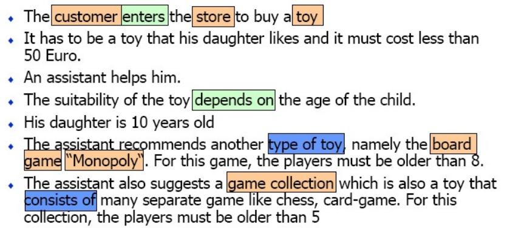

## Problem Statement
### Modeling Business Problem
### Toy Recommendation Application

- An application is required for Toy Outlet to offer a list of suitable toys 
for the child based on certain criteria (age, gender, price-range etc.). 

- Based on the data provided / entered by the customer, the application will show a list of toys that best suit the child. 
  
- The application will use methods/algorithms and constraints to 
select the toy. 

- Customers can view the various toys displayed by the app. 
  
- Analyze the problem given in text form.

- Appropriately handle any missing information/requirements by making 
reasonable assumptions.